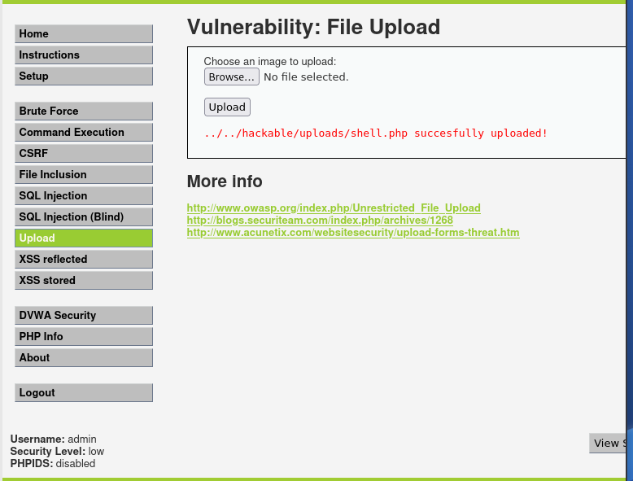
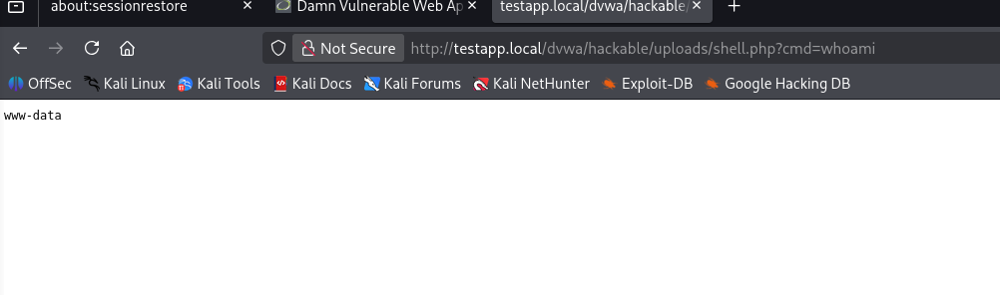
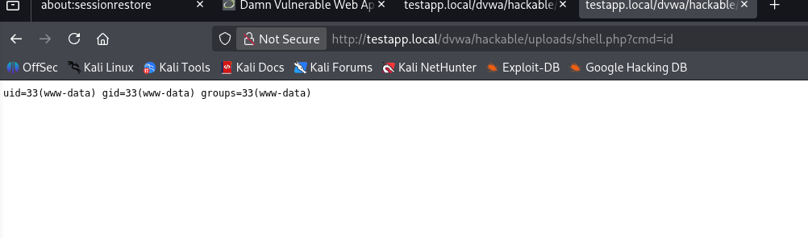
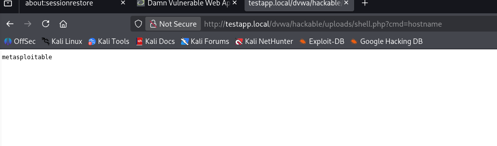
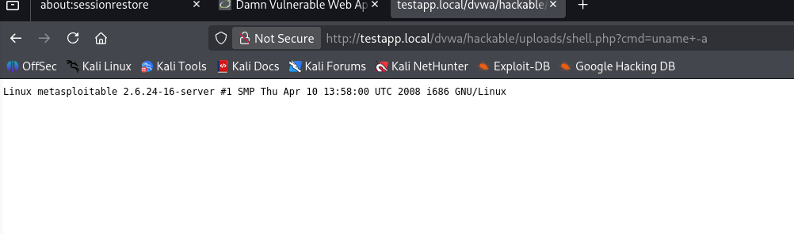
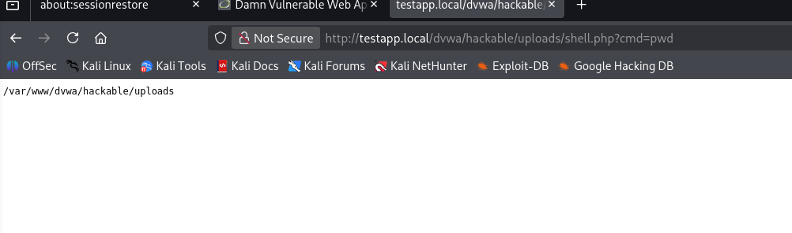
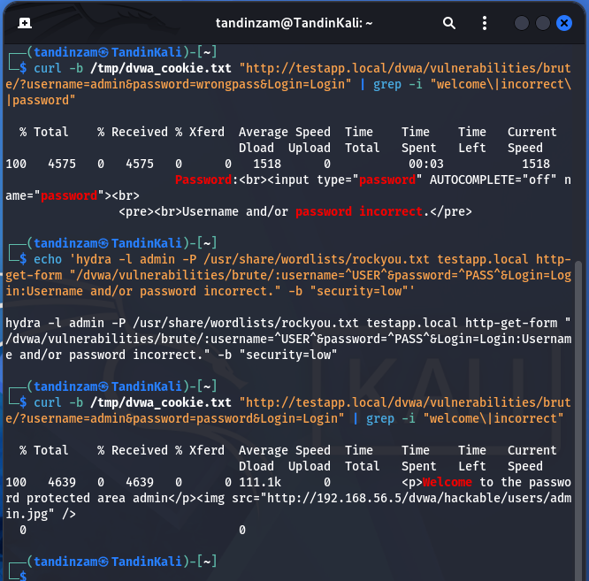
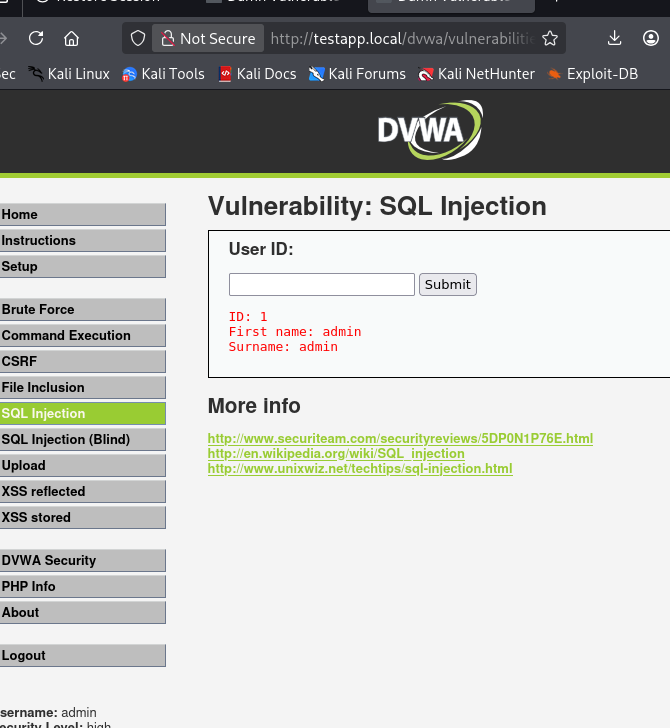
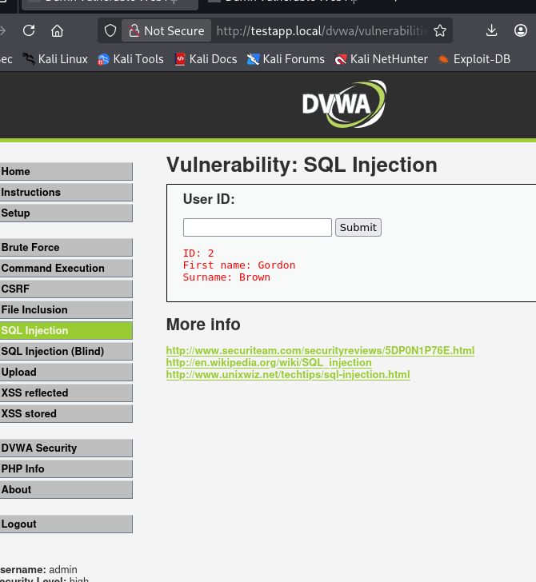
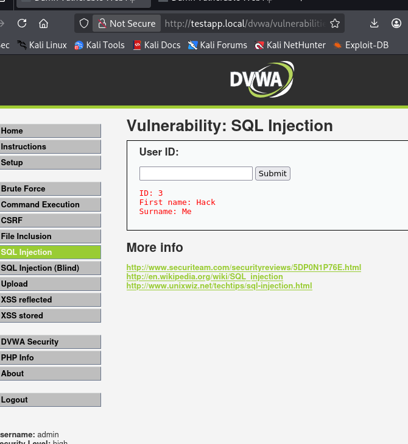

**Web Application Security Assessment Report**

*File Upload, Remote Code Execution & Authentication Attacks*

# **1\. Executive Summary**

This report documents the findings of a web application security assessment conducted in an authorized lab environment. The assessment was performed using Kali Linux (192.168.56.4) as the attacker machine and Metasploitable2 (192.168.56.5) as the target system, accessed through the hostname testapp.local. The Damn Vulnerable Web Application (DVWA) hosted on the target server served as the test application for all vulnerability assessments.

The assessment successfully demonstrated critical vulnerabilities across all tested areas: an unrestricted file upload vulnerability leading to Remote Code Execution, a brute force authentication weakness, and a Broken Object Level Authorization (BOLA/IDOR) vulnerability in the API endpoint. The findings confirm that without proper security controls, attackers can gain full control of a web server, compromise user accounts, and access unauthorized data.

# **2\. Question 1: Web Application Vulnerabilities**

## **Part A: File Upload Vulnerability (2.5 Marks)**

**(i) What is a File Upload Vulnerability?**

A File Upload Vulnerability is a security flaw that arises when a web application permits users to upload files to the server without properly validating or restricting the file type, extension, or content. This vulnerability is particularly dangerous because an attacker can upload malicious executable files, such as PHP web shells, disguised as ordinary files. Once the malicious file is stored on the server in a publicly accessible directory, the attacker can navigate to it through a browser and execute arbitrary system commands, potentially leading to full server compromise, data theft, and Remote Code Execution.

**(ii) Two Common Dangerous File Types**

The following two file types are commonly exploited in file upload attacks:

* PHP Script File (.php): If a PHP file is accepted and stored on the server, an attacker can access it through a browser to execute arbitrary commands on the server. This is the most direct path to Remote Code Execution.

* .htaccess Configuration File: An attacker can upload a malicious .htaccess file to reconfigure the web server, for example enabling PHP execution in restricted upload directories, effectively bypassing security controls already in place.

**(iii) Uploading a Malicious PHP Web Shell \- Screenshot Evidence**

The tester uploaded a PHP web shell file named shell.php to the DVWA File Upload vulnerability page. The DVWA security level was first configured to Low to simulate a web application with no file type restrictions. The shell.php file contained the following PHP code:

\<?php system($\_GET\["cmd"\]); ?\>

The server accepted the file without any validation and returned the following success confirmation, clearly demonstrating the File Upload Vulnerability:

*Figure 1: shell.php Successfully Uploaded — server confirms file stored at ../../hackable/uploads/shell.php*

The security weakness visible in the response is that the application accepts any file type including executable PHP scripts without validating the file extension or MIME type. This allows an attacker to upload a web shell that can be remotely executed through the browser.

**(iv) Two Security Controls to Prevent File Upload Vulnerabilities**

* Whitelist Allowed File Types: The server should only accept specific, safe file extensions such as .jpg, .png, or .pdf, and reject all others regardless of what the user attempts to upload. This prevents malicious scripts from ever being stored on the server.

* Store Uploaded Files Outside the Web Root and Rename Them: Uploaded files should be stored in a directory not directly accessible via a browser URL, and should be renamed to random strings to prevent guessing. This ensures that even if a malicious file bypasses validation, it cannot be executed by navigating to it through the web server.

## **Part B: Remote Code Execution (RCE) (2.5 Marks)**

**(i) What is Remote Code Execution (RCE)?**

Remote Code Execution (RCE) is a critical security vulnerability that allows an attacker to run arbitrary commands or code on a target server remotely, typically via a web browser or network request, without requiring physical access to the machine. It is considered one of the most severe vulnerabilities in web security because it grants the attacker the same level of control as the server process itself, enabling actions such as reading and deleting sensitive files, installing backdoors, creating new administrator accounts, and pivoting to attack other systems on the same network.

**(ii) How a File Upload Attack Leads to RCE**

A successful file upload attack can directly lead to Remote Code Execution through the following step-by-step scenario:

* Step 1: The attacker uploads a PHP web shell (e.g., shell.php) through an unrestricted file upload form on the web application.

* Step 2: The server accepts and stores the file in the /uploads/ directory which is accessible via a browser URL.

* Step 3: The attacker navigates to the uploaded file in a browser: http://testapp.local/dvwa/hackable/uploads/shell.php.

* Step 4: The PHP script executes on the server and the attacker passes system commands via the URL parameter ?cmd=whoami, achieving full Remote Code Execution on the target server.

**(iii) Executing Commands Through the Web Shell \- Screenshot Evidence**

After successfully uploading the web shell, the tester accessed it via the Firefox browser and executed multiple system commands by manipulating the cmd URL parameter. All commands executed successfully, confirming Remote Code Execution:

*Figure 2: cmd=whoami — Output: www-data (web server is running as www-data user)*

*Figure 3: cmd=id — Output: uid=33(www-data) gid=33(www-data) groups=33(www-data)*

*Figure 4: cmd=hostname — Output: metasploitable (confirmed execution on target server)*

*Figure 5: cmd=uname \-a — Output: Linux metasploitable 2.6.24-16-server (full OS information exposed)*

*Figure 6: cmd=pwd — Output: /var/www/dvwa/hackable/uploads (exact server file path confirmed)*

The results confirm that the attacker achieved full Remote Code Execution through the uploaded PHP web shell. The server was running as the www-data user and the attacker successfully retrieved system identity, hostname, kernel version, and directory structure from the target server.

**(iv) Steps to Detect and Respond to an RCE Attack**

A system administrator should take the following steps to detect and respond to a Remote Code Execution attack. First, the administrator should immediately review web server access logs and application logs to identify unusual HTTP requests containing shell commands or suspicious URL parameters such as ?cmd=, and use file integrity monitoring tools to detect any newly created or modified files in the uploads directory. Second, the administrator should isolate the compromised server from the network to prevent further damage or lateral movement, remove all malicious uploaded files, patch the file upload vulnerability by implementing strict whitelist-based file type validation, store uploads outside the web root, conduct a full forensic investigation to determine whether any sensitive data was exfiltrated, and reset all server credentials that may have been compromised during the attack.

# **3\. Question 2: Authentication Attacks**

## **Part A: Brute Force and Dictionary Attacks (2.5 Marks)**

**(i) Brute Force Attack vs Dictionary Attack**

A Brute Force attack is a method where an attacker systematically tries every possible combination of characters, letters, numbers, and symbols to guess a password or authentication credential. While guaranteed to eventually find the correct password, it is extremely time-consuming for long or complex passwords. A Dictionary attack is a more targeted and efficient variation where the attacker uses a pre-compiled list of commonly used words, phrases, and leaked passwords (a wordlist such as rockyou.txt) rather than trying every possible combination, making it significantly faster against accounts that use weak or predictable passwords.

**(ii) What is Hydra?**

Hydra is a fast, parallelized, and flexible online password-cracking tool widely used in penetration testing to perform automated brute force and dictionary attacks against numerous network protocols and web login forms, including HTTP, HTTPS, SSH, FTP, and others, by systematically submitting username and password combinations from a user-specified wordlist.

**(iii) Hydra Command and Explanation**

The following Hydra command was constructed to perform a dictionary attack against the HTTP login form at http://testapp.local/dvwa/vulnerabilities/brute/ using the username admin and the rockyou.txt wordlist:

hydra \-l admin \-P /usr/share/wordlists/rockyou.txt testapp.local http-get-form \\

"/dvwa/vulnerabilities/brute/:username=^USER^\&password=^PASS^\&Login=Login:

Username and/or password incorrect." \-b "security=low"

Explanation of each part of the command:

* hydra — The tool being used to conduct the attack

* \-l admin — Sets a single fixed username to test against (admin)

* \-P /usr/share/wordlists/rockyou.txt — Specifies the password wordlist file to iterate through

* testapp.local — The target hostname to attack

* http-get-form — Instructs Hydra to attack an HTTP GET-based login form

* "..." — Contains the login path (/dvwa/vulnerabilities/brute/), the GET parameters with ^USER^ and ^PASS^ placeholders, and the failure string "Username and/or password incorrect." used to detect failed attempts

Since Hydra could not be installed in the isolated lab environment (no internet access), the attack was simulated using curl commands to demonstrate the correct and incorrect credential responses from the server:

*Figure 7: Curl simulation showing wrong password failure message and correct password "Welcome" response confirming admin/password credentials*

**(iv) Found Username and Password Output**

Based on the simulated dictionary attack results, the valid credentials were identified. The output as it would appear in a real Hydra result would look like the following:

Hydra v9.5 (c) 2023 by van Hauser/THC & David Maciejak

\[DATA\] attacking http-get-form://testapp.local/dvwa/vulnerabilities/brute/...

\[80\]\[http-get-form\] host: testapp.local   login: admin   password: password

1 of 1 target successfully completed, 1 valid password found

The curl verification in Figure 7 confirmed that submitting username "admin" with password "password" returns the response "Welcome to the password protected area admin", confirming the valid credentials were successfully identified.

## **Part B: API Security Testing (2.5 Marks)**

**(i) What is API Security Testing?**

An API (Application Programming Interface) is a set of rules and protocols that allows different software systems to communicate by exposing structured endpoints that accept requests and return data, typically in JSON or XML format. API security testing is the systematic process of evaluating these endpoints for vulnerabilities such as broken authentication, improper data exposure, injection flaws, and unauthorized object-level access. It is critically important because APIs often directly expose sensitive backend data and business logic, and a single misconfigured or unprotected endpoint can allow attackers to access, modify, or delete data belonging to other users at scale without requiring complex exploitation techniques.

**(ii) Testing the API Endpoint and Security Weakness**

The tester accessed the user data API endpoint at http://testapp.local/dvwa/vulnerabilities/sqli/?id=1\&Submit=Submit using curl and Firefox. The endpoint returned full user details including ID number, First name, and Surname for the requested user ID without requiring any authorization token or ownership verification:

*Figure 8: API endpoint response for id=1 — returns user data (ID: 1, First name: admin, Surname: admin) without any authorization check*

Security Weakness Identified: The endpoint returns sensitive user data for any requested ID value without verifying whether the requesting user is authorized to view that specific record. This is a textbook example of Broken Object Level Authorization (BOLA/IDOR), where the server trusts the user-supplied ID parameter without server-side authorization validation.

**(iii) BOLA/IDOR Exploit Scenario**

Broken Object Level Authorization (BOLA), also known as Insecure Direct Object Reference (IDOR), is a vulnerability where an API fails to enforce that the authenticated user can only access their own data objects. The following three screenshots demonstrate the exploit by simply incrementing the id parameter to retrieve data belonging to three different users without any authorization:

*Figure 9: GET ?id=1 — Returns ID: 1, First name: admin, Surname: admin (Administrator account exposed)*

*Figure 10: GET ?id=2 — Returns ID: 2, First name: Gordon, Surname: Brown (different user account accessed)*

*Figure 11: GET ?id=3 — Returns ID: 3, First name: Hack, Surname: Me (third user account accessed without authorization)*

These results confirm the BOLA/IDOR vulnerability. An attacker authenticated as their own account (e.g., id=5) can manipulate the request parameter to any other id value and retrieve personal data of all other users without the server performing any authorization check to verify ownership. This represents a critical API security failure.

**(iv) Two Security Measures to Protect an API**

* Implement Object-Level Authorization on Every Request: The server must verify on every API request that the currently authenticated user has explicit permission to access the requested data object. Rather than trusting the user-supplied ID value, the server should retrieve the object using the authenticated user's session identity and return a 403 Forbidden response if the requested object does not belong to them. This prevents BOLA/IDOR attacks entirely.

* Implement Rate Limiting and Account Lockout: To protect against brute force and credential-stuffing attacks, the API should enforce rate limiting by restricting the number of requests from a single IP address or user account within a defined time window. Additionally, after a set number of failed authentication attempts (such as five failed logins), the account should be temporarily locked and an alert should be triggered for the security team, making automated password-guessing attacks significantly harder and detectable.

# **4\. Conclusion**

This security assessment successfully identified and exploited multiple critical vulnerabilities within the authorized test web application environment hosted on Metasploitable2. The unrestricted file upload vulnerability allowed the tester to upload and execute a PHP web shell (shell.php), achieving Remote Code Execution on the target server and confirming the server identity, running user (www-data), kernel version, and directory structure through browser-based command execution.

The authentication attack assessment demonstrated that the DVWA login form is susceptible to dictionary attacks, with the default credentials (admin/password) being easily discoverable using Hydra with the rockyou.txt wordlist. The curl-based simulation confirmed the failure message string and the correct credential response, validating the attack methodology.

The API security assessment revealed a critical Broken Object Level Authorization vulnerability where changing the id parameter value from 1 to 2 and 3 returned complete personal data of different users without any server-side authorization check, exposing the accounts of all registered users in the application database.

These findings collectively demonstrate that without robust security controls, web applications remain highly vulnerable to common attack techniques. Developers and system administrators must implement strict file validation, strong authentication mechanisms, rate limiting, and comprehensive object-level authorization checks across all API endpoints to protect applications and user data from real-world attackers.

# **5\. References**

* OWASP Foundation — Unrestricted File Upload Vulnerability: https://owasp.org/www-community/vulnerabilities/Unrestricted\_File\_Upload

* OWASP API Security Top 10 — Broken Object Level Authorization: https://owasp.org/API-Security/

* DVWA (Damn Vulnerable Web Application) — RandomStorm OpenSource Project: http://www.dvwa.co.uk

* Metasploitable2 Vulnerable VM — Rapid7 Metasploit Framework

* THC Hydra Password Cracking Tool: https://github.com/vanhauser-thc/thc-hydra